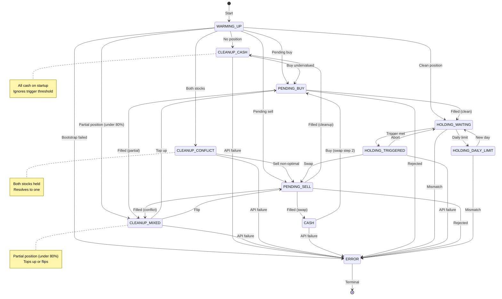

# State Machine Flow Diagram

This document provides a visual flow diagram for the pairs trading algorithm's state machine, along with detailed documentation of each state, transitions, and the data tracked throughout the trading lifecycle.

## Visual State Diagram



## State Descriptions

### WARMING_UP (State 0)
**Purpose:** Bootstrap the moving average from historical data

**Entry Conditions:**
- Algorithm initialization

**Activities:**
- Fetch 240 minutes of 1-minute historical bars
- Calculate initial moving average
- Query TradeStation for existing positions (recovery mode)

**Exit Conditions:**
- No position → CLEANUP_CASH
- Partial position (under 80%) → CLEANUP_MIXED
- Both stocks → CLEANUP_CONFLICT
- Clean position → HOLDING_WAITING
- Pending order → PENDING_BUY or PENDING_SELL
- Failure → ERROR

**State Data:**
- `current_stock`: Set based on API position query
- All counters reset

---

### CLEANUP_CASH (State 1)
**Purpose:** All cash on startup - buy undervalued stock (ignores trigger)

**Entry Conditions:**
- MA bootstrap complete with no position
- Cleanup conflict sell completed

**Activities:**
- Determine undervalued stock from current ratio
- Buy immediately (respects market hours, ignores trigger threshold)
- Calculate shares based on buying power or allocated_cash

**Exit Conditions:**
- Buy initiated → PENDING_BUY
- API failure → ERROR

**State Data:**
- `current_stock`: NONE
- `pending_order_id`: None

**Note:** Uses >= for ties (favors ticker_b at exactly zero deviation)

---

### CLEANUP_MIXED (State 2)
**Purpose:** Partial position detected - resolve to full position

**Entry Conditions:**
- MA bootstrap with position under 80% threshold
- Top-up buy completed but still partial
- Cleanup conflict sell with remaining position

**Activities:**
- Evaluate current ratio to determine optimal stock
- If current stock is optimal → top up position
- If ratio flipped → sell and flip to other stock
- Ignores trigger threshold

**Exit Conditions:**
- Top up buy → PENDING_BUY
- Flip sell → PENDING_SELL
- API failure → ERROR

**State Data:**
- `current_stock`: TICKER_A or TICKER_B
- `pending_order_id`: None

**Threshold:** Position value < 80% of (allocated_cash or buying_power)

---

### CLEANUP_CONFLICT (State 3)
**Purpose:** Both stocks held - should never happen, resolve to one

**Entry Conditions:**
- MA bootstrap found positions in both stocks
- Manual intervention or bug created invalid state

**Activities:**
- Determine optimal stock from current ratio
- Sell the non-optimal stock
- Keep the optimal stock

**Exit Conditions:**
- Sell initiated → PENDING_SELL
- API failure → ERROR

**State Data:**
- `current_stock`: NONE (conflict)
- `pending_order_id`: None

**Note:** After sell, transitions to CLEANUP_CASH, CLEANUP_MIXED, or HOLDING_WAITING depending on remaining position

---

### CASH (State 4)
**Purpose:** Intermediary state during swap (sell complete, buy pending)

**Entry Conditions:**
- Sell order completed during normal swap

**Activities:**
- Immediate transition to buy
- Very brief state (milliseconds)

**Exit Conditions:**
- Buy initiated → PENDING_BUY
- API failure → ERROR

**State Data:**
- `current_stock`: NONE
- `pending_order_id`: None

**Note:** Different from CLEANUP_CASH - CASH is always mid-swap

---

### PENDING_BUY (State 5)
**Purpose:** Buy order placed, waiting for fill confirmation

**Entry Conditions:**
- Buy order submitted

**Activities:**
- Poll order status via API
- Wait for order status = "Filled"
- Log actual fill price and slippage

**Exit Conditions:**
- Order filled (clean) → HOLDING_WAITING
- Order filled (partial) → CLEANUP_MIXED
- Order rejected → ERROR
- Timeout (60 seconds) → ERROR

**State Data:**
- `current_stock`: Set to ticker being bought
- `pending_order_id`: Order ID from TradeStation

---

### HOLDING_WAITING (State 6)
**Purpose:** Main monitoring state - holding position, watching for trigger

**Entry Conditions:**
- Buy order filled (clean position)
- Daily limit reset to new day
- Swap aborted

**Activities:**
- Poll quotes every 1 second
- Update ratio and MA continuously
- Check trigger condition: `abs(ratio / MA - 1) > trigger_percent`
- Run reconciliation every 60 seconds
- Monitor for daily limit

**Exit Conditions:**
- Trigger met → HOLDING_TRIGGERED
- Daily limit reached → HOLDING_DAILY_LIMIT
- Position mismatch → ERROR

**State Data:**
- `current_stock`: TICKER_A or TICKER_B
- `pending_order_id`: None
- `trades_today`: Tracked and incremented

---

### HOLDING_TRIGGERED (State 7)
**Purpose:** Trigger condition met, about to initiate swap

**Entry Conditions:**
- In HOLDING_WAITING
- Ratio deviation exceeds trigger_percent threshold

**Activities:**
- Verify trigger condition still met
- Check swap cutoff time
- Check daily trade limit
- Prepare for swap execution

**Exit Conditions:**
- Proceed with swap → PENDING_SELL
- Abort → HOLDING_WAITING
- API failure → ERROR

**State Data:**
- `current_stock`: Unchanged
- `portfolio_value_at_trade_start`: Captured for return calculation

---

### PENDING_SELL (State 8)
**Purpose:** Sell order placed, waiting for fill

**Entry Conditions:**
- Swap initiated from HOLDING_TRIGGERED
- Cleanup sell initiated

**Activities:**
- Poll order status via API
- Wait for order status = "Filled"
- Log actual fill price and slippage
- Calculate actual proceeds

**Exit Conditions:**
- Sell filled (normal swap) → CASH
- Sell filled (cleanup to cash) → CLEANUP_CASH
- Sell filled (cleanup with remaining) → CLEANUP_MIXED
- Sell filled (now clean) → HOLDING_WAITING
- Order rejected → ERROR
- Timeout → ERROR

**State Data:**
- `current_stock`: About to change
- `pending_order_id`: Sell order ID

**Note:** Transitions depend on context (normal swap vs cleanup)

---

### HOLDING_DAILY_LIMIT (State 9)
**Purpose:** Position held, daily trade limit reached

**Entry Conditions:**
- In HOLDING_WAITING
- `trades_today` >= `trades_per_day_limit` (from settings.yaml)
- `enforce_one_trade_per_day` check also enforced

**Activities:**
- Continue monitoring ratio and MA (logging only)
- Continue reconciliation
- Check for new trading day (date change)
- NO trading actions taken

**Exit Conditions:**
- New trading day detected → HOLDING_WAITING (counter reset)
- Position mismatch → ERROR

**State Data:**
- `current_stock`: Unchanged
- `trades_today`: At limit
- `last_trade_day`: Date of last trade

**Safety Note:** This state prevents overtrading. Both `trades_per_day_limit` and `enforce_one_trade_per_day` must allow the trade.

---

### ERROR (State 10)
**Purpose:** Fatal error occurred, algorithm frozen

**Entry Conditions:**
- Order rejected by TradeStation
- Position mismatch during reconciliation
- API retries exhausted
- Invalid state transition attempted
- Any CRITICAL error

**Activities:**
- Log CRITICAL error with full context
- Emit error metrics to Grafana
- Halt all trading activity
- Preserve state for debugging

**Exit Conditions:**
- **NONE** - Terminal state
- Requires manual restart of algorithm

**State Data:**
- All data preserved for debugging

**Recovery Procedure:**
1. Check logs for CRITICAL error pattern
2. Identify root cause (ORDER_REJECTED, POSITION_MISMATCH, etc.)
3. Manually resolve issue (fund account, fix positions, etc.)
4. Restart algorithm
5. Algorithm will recover state from TradeStation API

---

## State Data Tracked

The `StateData` class (lines 106-126 in `state_machine.py`) tracks the following across states:

| Field | Type | Description |
|-------|------|-------------|
| `current_stock` | StockHeld | Which stock is held: NONE, TICKER_A, or TICKER_B |
| `pending_order_id` | Optional[str] | Order ID when in PENDING states |
| `trades_today` | int | Count of trades executed today |
| `last_trade_day` | Optional[str] | Date of last trade (for daily reset) |
| `portfolio_value_at_trade_start` | float | Portfolio value when trade sequence began |

---

## Transition Triggers

### Automatic Transitions (Algorithm-Driven)

| From State | To State | Trigger |
|------------|----------|---------|
| WARMING_UP | CASH | MA bootstrap complete, no position |
| WARMING_UP | HOLDING_WAITING | MA bootstrap complete, has position |
| PENDING_BUY | HOLDING_WAITING | Order status = "Filled" |
| HOLDING_WAITING | HOLDING_TRIGGERED | `abs(ratio/MA - 1) > trigger_percent` |
| HOLDING_WAITING | HOLDING_DAILY_LIMIT | `trades_today >= limit` |
| HOLDING_TRIGGERED | PENDING_SELL | Swap execution approved |
| HOLDING_TRIGGERED | HOLDING_WAITING | Swap aborted (cutoff time) |
| PENDING_SELL | CASH | Order status = "Filled" |
| HOLDING_DAILY_LIMIT | HOLDING_WAITING | New trading day (date change) |

### Error Transitions (Exception-Driven)

Any state can transition to ERROR when:
- API call fails after retry exhaustion
- Order rejected by TradeStation
- Position mismatch detected in reconciliation
- Invalid state transition attempted
- Any exception marked CRITICAL

---

## Trading Flow Examples

### Successful Swap Flow

```
HOLDING_WAITING (holding V)
  ↓ (ratio too high, V overvalued)
HOLDING_TRIGGERED
  ↓ (initiate swap)
PENDING_SELL (selling V)
  ↓ (order filled)
CASH (proceeds available)
  ↓ (immediate buy)
PENDING_BUY (buying MA)
  ↓ (order filled)
HOLDING_WAITING (holding MA)
```

### Initial Buy Flow

```
WARMING_UP (bootstrapping MA)
  ↓ (MA ready, no position)
CASH (ready to trade)
  ↓ (algorithm determines undervalued stock)
PENDING_BUY (buying undervalued stock)
  ↓ (order filled)
HOLDING_WAITING (monitoring for triggers)
```

### Daily Limit Flow

```
HOLDING_WAITING (1 trade done today)
  ↓ (trigger met again)
HOLDING_TRIGGERED
  ↓ (daily limit check fails)
HOLDING_WAITING (abort - can't trade)
  ↓ (limit officially hit)
HOLDING_DAILY_LIMIT (frozen for today)
  ↓ (next day arrives)
HOLDING_WAITING (reset, ready to trade)
```

### Error Recovery Flow

```
HOLDING_WAITING
  ↓ (API failure after retries)
ERROR (frozen)
  ↓ (manual investigation)
[Fix issue in TradeStation]
  ↓ (restart algorithm)
WARMING_UP (bootstrap MA)
  ↓ (recover existing position)
HOLDING_WAITING (resumed)
```

---

## Code References

**State Machine Implementation:**
- `live_trading/state_machine.py` - Core state machine class
  - Lines 29-44: `TradingState` enum definitions
  - Lines 55-98: `VALID_TRANSITIONS` dictionary
  - Lines 128-336: `StateMachine` class

**State Usage in Main Algorithm:**
- `live_trading/live_pairs_trader.py` - Main trading loop
  - State transitions occur throughout the main loop
  - Trigger checking in monitoring logic
  - Order execution flows

**Configuration:**
- `live_trading/settings.yaml`
  - Line 55: `trades_per_day_limit`
  - Line 61: `enforce_one_trade_per_day`
  - Line 45: `trigger_percent`
  - Line 121: `swap_cutoff_minutes_before_close`

---

## Monitoring State Transitions

### Prometheus Metric

```promql
pairs_trader_state{service_name="PairTraderPro"}
```

**Values:** 0-7 corresponding to state enum values

**Visualization:** Use Grafana state timeline panel to see state changes over time

### Log Patterns

State transitions are logged with:
```
[INFO] State transition: HOLDING_WAITING → HOLDING_TRIGGERED (reason: Trigger condition met)
```

Filter in Loki:
```logql
{service_name="PairTraderPro"} |= "State transition"
```

---

## Safety Considerations

1. **Sequential Order Execution:** The PENDING_SELL → CASH → PENDING_BUY flow ensures sell completes before buy starts, eliminating margin requirements.

2. **Daily Limit Protection:** Two-layer check (`trades_per_day_limit` + `enforce_one_trade_per_day`) prevents runaway trading.

3. **Swap Cutoff:** No swaps initiated within 10 minutes of market close (configurable).

4. **Error State is Terminal:** Algorithm won't auto-recover from ERROR state, requiring manual intervention to prevent compounding issues.

5. **Reconciliation:** Periodic position checks ensure internal state matches TradeStation reality.

6. **Full Fill Requirement:** Algorithm never proceeds with partial fills, only "Filled" status.

---

*Generated from state_machine.py version as of January 2026*

